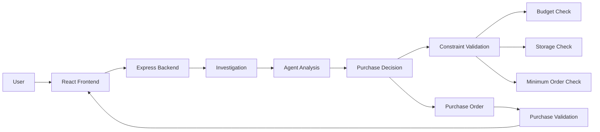

# PurchaseAI Architecture

## System Architecture

## Architecture Overview

PurchaseAI follows a frontend-backend architecture.

### Frontend
React + Vite provides the user interface for investigating purchasing situations, viewing agent decisions, executing purchases and validating purchase orders.

### Backend
Node.js + Express provides the REST APIs used by the frontend.

### Agent Analysis
The agent evaluates:

- Current inventory
- Expected demand
- Open purchase orders
- Supplier information
- Available budget
- Storage capacity
- Minimum order quantity

### Purchase Decision
The agent generates a purchasing recommendation based on the available information and constraints.

The decision can modify the original system recommendation when the calculated requirement is different.

### Validation
Before completing a purchase, the system validates:

- Budget availability
- Storage capacity
- Minimum order quantity
- Purchase quantity

## Data Flow

1. User opens the PurchaseAI frontend.
2. Frontend requests purchasing information from the backend.
3. Backend provides inventory, demand, supplier and purchasing constraints.
4. Agent analyzes the collected information.
5. Agent generates a purchase decision.
6. Decision is checked against purchasing constraints.
7. Validated result is displayed to the user.